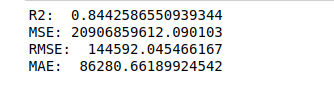
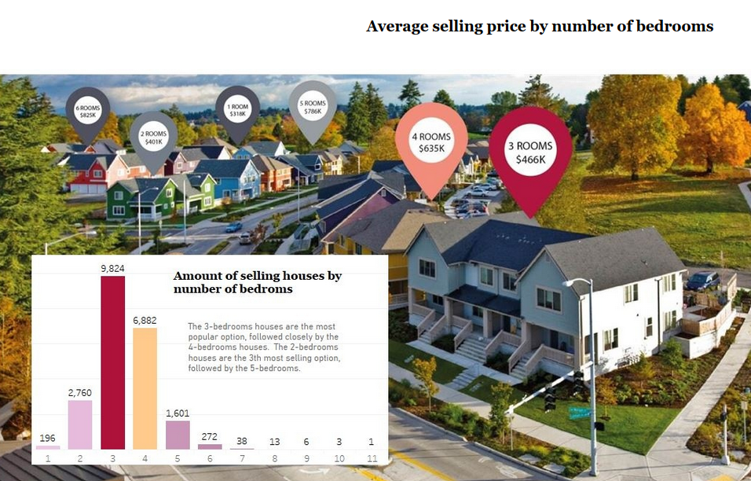

# Case Study: Regression

Colaborators [Marian Moreno](https://github.com/marimor62) and [Antonio Saleme](https://github.com/antonio-datahack)

### Index:

* [Scenario](#section1)
* [Objetive](#section2)
* [Approach](#section3)
* [First ideas](#section4)
* [In-Depth Analysis](#section5)
* [Conclusions](#section6)
* [Tableau](https://github.com/marimor62/Midtermproject-Housing/tree/main/Tableau)
* [SQL](https://github.com/marimor62/Midtermproject-Housing/tree/main/SQL)

### Scenario

In this project we are working as analysts for a real estate company. Our company "Luna Lovegood"  created a machine learning model to predict the selling prices of houses based on a variety of features on which the value of the house is evaluated.

### Objective

The senior management of the real estate company also wants to explore the characteristics of the houses using some business intelligence tools. One of those parameters includes understanding which factors are responsible for higher property value - $650K and above.
We followed this workflow in Python in order to build the required model:

### Approach

The dataset we used consists of information on 22,000 properties and contains historic data of houses sold between May 2014 to May 2015.
Our first approach consisted of:
                                * Importing the data
                                * Exploring the data (EDA Method)
                                * Data wrangling
                                * Data cleaning
                                * Check for multicolinearity

 
### First ideas

* The total dataset consited not of 22,000 rows but of 21,597 rows.
We did not find any duplicated data but some of the houses were sold more than once during the time period between May 2014 to May 2015. As we wanted to predict the price of houses regarding different features such as the year when it was sold, there was no need to drop or modify these rows.
* We found a share of renovated houses of 4.23%.
* We also found a house with 33 rooms - outlier or typo? We figured that a house with 33 rooms could be a hostel or hotel but then we noticed that the 33 rooms are located on just one floor with around 100 sqm. This clearly has to be an error, because it is physically unlikely. This piece of data seems to be a typo and it should actually be 3 bedrooms.
* We clarified the definitions of the feature "bathrooms":

* We decided to extract the month and quarter (not the year) as they will be more interesting for later analysis.

### In-Depth Analysis

* We proceeded to realize the first iteration of our Machine Learning Model,
and our accuracy score R2 was relatively close to 1, so the model performs well, but we wanted to improved it.
* In the second iteration we did a preprocessing: We went through the standardization using StandardScaler to rescale and OneHotEncoder to process the categoricals. We got a better R2:

* We went through a third iteration, this time we did a rescale using the logarithmic method and we normalized the data using the Dummies Encoder

### Tableau
[Link to tableau story](https://public.tableau.com/profile/marian.moreno#!/vizhome/Book1_16190202108450/Story1)

* Our assignment also included visualization with Tableau. We aimed to visualize our findings in a way that a non-technical audience would understand while maintaning a style that is both pleasing and unequivocal.

### SQL

By using SQL we tried to reach a deeper understanding of our dataset. We used queries to answer the questions posed by the real estate company. Follow the [link](https://github.com/marimor62/Midtermproject-Housing/blob/69d56c6d43351a4e1fe94910e53ff1ff00e6865f/SQL/proj_luna.sql) to dive into our queries. 
